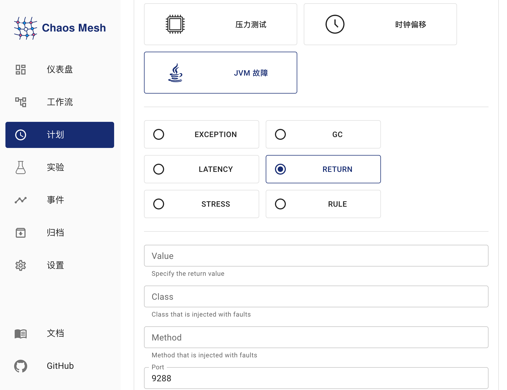

Chaos Mesh 通过 [Byteman](https://github.com/chaos-mesh/byteman) 模拟 JVM 应用故障，主要支持以下类型的故障：：

- 抛出自定义异常
- 触发垃圾回收
- 增加方法延迟
- 指定方法返回值
- 设置 Byteman 配置文件触发故障
- 增加 JVM 压力

同时，Chaos Mesh 支持对常用的服务或其 Java 客户端注入上述的故障。比如，当 MySQL Java 客户端执行指定类型的 SQL 语句（`SELECT`，`UPDATE`，`INSERT`，`REPLACE` 或 `DELETE`）时，你可以使用 JVM 故障注入功能在该客户端注入延迟或抛出异常。

本文主要介绍如何创建以上故障类型的 JVM 实验。

:::note 注意

Linux 系统内核必须为 4.1 及以上版本。

:::

## 使用 Dashboard 方式创建实验

1. 单击实验页面中的“新的实验”按钮创建实验：

   

2. 在“选择目标”处选择 “JVM 故障”，然后选择具体行为（如 `RETURN`），最后填写具体配置：

   

   具体配置的填写方式，参考[字段说明](#字段说明)。

3. 填写实验信息，指定实验范围以及实验计划运行时间：

   

4. 提交实验。

## 使用 YAML 方式创建实验

下面将以指定返回值为例，展示 JVMChaos 的使用方法与效果。以下内容中涉及的 YAML 文件均可在 [examples/jvm](https://github.com/chaos-mesh/chaos-mesh/tree/master/examples/jvm) 中找到，以下步骤默认的工作路径也是在 `examples/jvm` 中。 默认 Chaos Mesh 安装的命名空间为 `chaos-testing`。

### 第 1 步：创建被测应用

[Helloworld](https://github.com/WangXiangUSTC/byteman-example/tree/main/example.helloworld) 是一个简单的 Java 应用，此处作为被测应用。被测应用定义在 `example/jvm/app.yaml` 中，内容如下：

```yaml
apiVersion: v1
kind: Pod
metadata:
  name: helloworld
  namespace: helloworld
spec:
  containers:
    - name: helloworld
      # source code: https://github.com/WangXiangUSTC/byteman-example/tree/main/example.helloworld
      # this application will print log like this below:
      # 0. Hello World
      # 1. Hello World
      # ...
      image: xiang13225080/helloworld:v1.0
      imagePullPolicy: IfNotPresent
```

1. 创建应用所属的 namespace：

   ```shell
   kubectl create namespace helloworld
   ```

2. 建立该应用 Pod：

   ```shell
   kubectl apply -f app.yaml
   ```

3. 执行 `kubectl -n helloworld get pods`，预期能够观察到命名空间 `helloworld` 中名为 `helloworld` 的 Pod。

   ```shell
   kubectl -n helloworld get pods
   ```

预期结果如下：

```text
kubectl get pods -n helloworld
NAME         READY   STATUS    RESTARTS   AGE
helloworld   1/1     Running   0          2m
```

等待 `READY` 成为 `1/1` 后，可以进行下一步。

### 第 2 步：观测未被注入时的行为

在注入前你可以先观测应用 `helloworld` 未被注入时的行为，例如：

```shell
kubectl -n helloworld logs -f helloworld
```

输出如下所示：

```shell
0. Hello World
1. Hello World
2. Hello World
3. Hello World
4. Hello World
5. Hello World
```

可以看到 `helloworld` 每隔一秒输出一行 `Hello World`，每行的编号依次递增。

### 第 3 步：注入 JVMChaos 并验证

1. 指定返回值的 JVMChaos 内容如下：

   ```yaml
   apiVersion: chaos-mesh.org/v1alpha1
   kind: JVMChaos
   metadata:
     name: return
     namespace: helloworld
   spec:
     action: return
     class: Main
     method: getnum
     value: '9999'
     mode: all
     selector:
       namespaces:
         - helloworld
   ```

JVMChaos 将 `getnum` 方法的返回值修改为数字 `9999`，也就是让 `helloworld` 的每行输出的编号都设置为 `9999`。

2. 注入指定返回值的 JVMChaos：

   ```shell
   kubectl apply -f ./jvm-return-example.yaml
   ```

3. 查看 `helloworld` 的最新日志：

   ```shell
   kubectl -n helloworld logs -f helloworld
   ```

   日志如下所示：

   ```shell
   Rule.execute called for return_0:0
   return execute
   caught ReturnException
   9999. Hello World
   ```

## 字段说明

| 参数 | 类型 | 说明 | 默认值 | 是否必填 | 示例 |
| --- | --- | --- | --- | --- | --- |
| `action` | string | 表示具体的故障类型，支持 `latency`、`return`、`exception`、`stress`、`gc`、`ruleData`。 | 无 | 是 | `return` |
| `mode` | string | 表示选择 Pod 的方式，支持 `one`、`all`、`fixed`、`fixed-percent`、`random-max-percent`。 | 无 | 是 | `one` |

关于 `action` 的取值的含义，可参考以下内容：

| 取值        | 含义                                                          |
| ----------- | ------------------------------------------------------------- |
| `latency`   | 增加方法延迟                                                  |
| `return`    | 修改方法返回值                                                |
| `exception` | 抛出自定义异常                                                |
| `stress`    | 提高 Java 进程 CPU 使用率，或者造成内存溢出（支持堆、栈溢出） |
| `gc`        | 触发垃圾回收                                                  |
| `ruleData`  | 设置 Byteman 配置触发故障                                     |
| `mysql`     | 对 MySQL Java 客户端注入故障 |

针对不同的 `action` 的值，有不同的配置项可以填写。

### `latency` 相关参数

| 参数      | 类型        | 说明                                                                | 是否必填 |
| --------- | ----------- | ------------------------------------------------------------------- | -------- |
| `class`   | string 类型 | Java 类的名称                                                       | 是       |
| `method`  | string 类型 | 方法名称                                                            | 是       |
| `latency` | int 类型    | 增加方法的延迟时间，单位为 ms                                       | 是       |
| `port`    | int 类型    | 附加到 Java 进程 agent 的端口号，通过该端口号将故障注入到 Java 进程 | 否       |

### `return` 相关参数

| 参数 | 类型 | 说明 | 是否必填 |
| --- | --- | --- | --- |
| `class` | string 类型 | Java 类的名称 | 是 |
| `method` | string 类型 | 方法名称 | 是 |
| `value` | string 类型 | 指定方法的返回值，目前支持数字和字符串类型的返回值，如果为字符串，则需要使用双引号，例如："chaos"。 | 是 |
| `port` | int 类型 | 附加到 Java 进程 agent 的端口号，通过该端口号将故障注入到 Java 进程 | 否 |

### `exception` 相关参数

| 参数        | 类型        | 说明                                                                | 是否必填 |
| ----------- | ----------- | ------------------------------------------------------------------- | -------- |
| `class`     | string 类型 | Java 类的名称                                                       | 是       |
| `method`    | string 类型 | 方法名称                                                            | 是       |
| `exception` | string 类型 | 抛出的自定义异常，例如：'java.io.IOException("BOOM")'               | 是       |
| `port`      | int 类型    | 附加到 Java 进程 agent 的端口号，通过该端口号将故障注入到 Java 进程 | 否       |

### `stress` 相关参数

| 参数 | 类型 | 说明 | 是否必填 |
| --- | --- | --- | --- |
| `cpuCount` | int 类型 | 增加 CPU 压力所使用的 CPU 核的数量，`cpuCount` 和 `memType` 中必须配置一个 | 否 |
| `memType` | string 类型 | 内存 OOM 的类型，目前支持 "stack" 和 "heap" 两种类型，`cpuCount` 和 `memType` 中必须配置一个 | 否 |
| `port` | int 类型 | 附加到 Java 进程 agent 的端口号，通过该端口号将故障注入到 Java 进程 | 否 |

### `gc` 相关参数

| 参数   | 类型     | 说明                                                                | 是否必填 |
| ------ | -------- | ------------------------------------------------------------------- | -------- |
| `port` | int 类型 | 附加到 Java 进程 agent 的端口号，通过该端口号将故障注入到 Java 进程 | 否       |

### `ruleData` 相关参数

| 参数       | 类型        | 说明                                                                | 是否必填 |
| ---------- | ----------- | ------------------------------------------------------------------- | -------- |
| `ruleData` | srting 类型 | 指定 Byteman 配置数据                                               | 是       |
| `port`     | int 类型    | 附加到 Java 进程 agent 的端口号，通过该端口号将故障注入到 Java 进程 | 否       |

当编写规则配置文件时，你需要根据具体的 Java 程序，并参考 [byteman-rule-language](https://downloads.jboss.org/byteman/4.0.16/byteman-programmers-guide.html#the-byteman-rule-language)。例如：

```txt
RULE modify return value
CLASS Main
METHOD getnum
AT ENTRY
IF true
DO
    return 9999
ENDRULE
```

将配置中的换行转换为换行符 "\n"，将转换后的数据设置为参数 "ruleData" 的值，如上的配置转换为：

```txt
\nRULE modify return value\nCLASS Main\nMETHOD getnum\nAT ENTRY\nIF true\nDO return 9999\nENDRULE\n"
```

### `mysql` 相关参数

| 参数       | 类型        | 说明                                                                | 是否必填 |
| ---------- | ----------- | ------------------------------------------------------------------- | -------- |
| `mysqlConnectorVersion` | string 类型 | 使用的 MySQL 客户端 (mysql-connector-java) 的版本，对于 5.X.X 版本设置为 `"5"`，对于 8.X.X 版本设置为 `"8"`。默认值为 `"8"`。 | 否 |
| `database` | string 类型 | 匹配的指定的库名称，默认值为 `""`，即匹配所有的库。 | 否 |
| `table` | string 类型 | 匹配的指定的表名称，默认值为 `""`，即匹配所有的表。 | 否 |
| `sqlType` | string 类型 | 匹配的 SQL 类型，可选值为 `"select"`、`"update"`、`"insert"`、`"replace"`、`"delete"`，默认值为 `""`，即匹配所有类型的 SQL。 |否 |
| `exception` | string 类型 | 抛出的自定义异常信息，如 "BOOM"。`exception` 和 `latency` 中必须配置一个。              | 否 |
| `latency` | int 类型   | 执行 SQL 的延迟时间，单位为 ms，如 `1000`。`exception` 和 `latency` 中必须配置一个。            | 否 |
| `port`      | int 类型  | 附加到 Java 进程 agent 的端口号，通过该端口号将故障注入到 Java 进程。 | 否 |